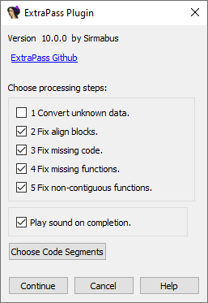

# ExtraPass IDA Pro Plug-In

Kevin Weatherman aka "Sirmabus"
Repo [Github](https://github.com/kweatherman/IDA_ExtraPass_PlugIn), former: [SourceForge](https://sourceforge.net/projects/idaextrapassplugin/)

An IDA Pro Windows executable cleanup plugin.  

----

## Introduction

IDA Pro is a powerful reverse engineering and binary analysis tool, but it can struggle with some Windows executables, especially those involving complex C++ OOP, disjointed functions, or embedded script systems with small script bind stubs (common in game targets). 
ExtraPass plugin performs an "extra pass" to clean up and enhance Windows IDBs by addressing common issues such as:

- Identifying tens of thousands of missing functions.
- Converting misidentified data back to code.
- Fixing alignment blocks.
- Correcting improperly marked "tail blocks" into function bodies.

This results in a more complete and accurate IDB, making reverse engineering easier.

### Processing Steps
The plugin operates in five key steps:
1. Marks stray data in code sections as "unknown" to prepare for further processing.
2. Converts stray align/NOP bytes into proper alignment blocks.
3. Fixes stray code bytes within code sections.
4. Identifies and defines missing/undefined functions in gaps between existing functions.
5. Repairs non-contiguous functions with incorrect tail blocks.

### Compatibility
- **Intended for**: Typical MSVC and Intel-compiled Windows x86/AMD64 binary executables.
- **Limitations**: May not work well with packed executables, those with anti-reverse engineering measures (e.g., functions in `.rdata`), or non-Windows platforms. Unexpected results may occur in such cases.

## Installation

1. Copy the plugin to your IDA Pro `plugins` directory.
2. Optionally, edit `plugins.cfg` to assign a hotkey for quick access (as you would for any IDA plugin).
3. Alternatively, run the plugin directly from IDA Pro’s `Edit -> Plugins` menu.

## Usage

1. **Backup Your IDB**:  
   The plugin automates significant changes to your IDB, which could have unintended effects. Save your IDB, create a backup, or take a snapshot before proceeding.

2. **Run the Plugin**:  
   
   - Launch the plugin via the assigned hotkey or the `Edit -> Plugins` menu.
   
   - A dialog will appear, allowing you to select which processing steps to execute. By default, all steps are enabled, but you can customize this (e.g., skip steps for targets with unusual embedded data to focus on function fixes).
   
     **Warning:** Be careful of option #1 "Convert unknown data" (non defaults unchecked). It's really for extreme cases where an IDB is a mess from executable packing, obfuscation, etc. Might mess up switch statement data tables, etc.
   
   - By default, the plugin processes the first `.text` code segment. To process other segments, click the "Choose code segments" button and select the desired segments (multiple selections supported).
   
3. **Processing**:  
   - The plugin may take some time to complete, especially for large executables with thousands of functions.
   - Once finished, the output window will display the number of functions found, fixes applied, and other improvements. You may also notice fewer gray/unknown areas in IDA’s navigator scale bar.

4. **Iterate for Best Results**:  
   - For optimal results, run the plugin multiple times until the number of newly found functions approaches zero.
   
     Example: On a large, complex executable, the first run recovered 13,000 missing functions, the second run found 1,000, and subsequent runs found fewer.

## Notes
- The plugin is designed for standard Windows executable patterns. Non-standard or obfuscated binaries may produce suboptimal results.

  

----

##### License

**MIT License**
Copyright © 2009–present Kevin Weatherman  

Permission is hereby granted, free of charge, to any person obtaining a copy of this software and associated documentation files (the "Software"), to deal in the Software without restriction, including without limitation the rights to use, copy, modify, merge, publish, distribute, sublicense, and/or sell copies of the Software, and to permit persons to whom the Software is furnished to do so, subject to the following conditions:

The above copyright notice and this permission notice shall be included in all copies or substantial portions of the Software.

THE SOFTWARE IS PROVIDED "AS IS", WITHOUT WARRANTY OF ANY KIND, EXPRESS OR IMPLIED, INCLUDING BUT NOT LIMITED TO THE WARRANTIES OF MERCHANTABILITY, FITNESS FOR A PARTICULAR PURPOSE, AND NONINFRINGEMENT. IN NO EVENT SHALL THE AUTHORS OR COPYRIGHT HOLDERS BE LIABLE FOR ANY CLAIM, DAMAGES, OR OTHER LIABILITY, WHETHER IN AN ACTION OF CONTRACT, TORT, OR OTHERWISE, ARISING FROM, OUT OF, OR IN CONNECTION WITH THE SOFTWARE OR THE USE OR OTHER DEALINGS IN THE SOFTWARE.

See [MIT License](http://www.opensource.org/licenses/mit-license.php) for full details.